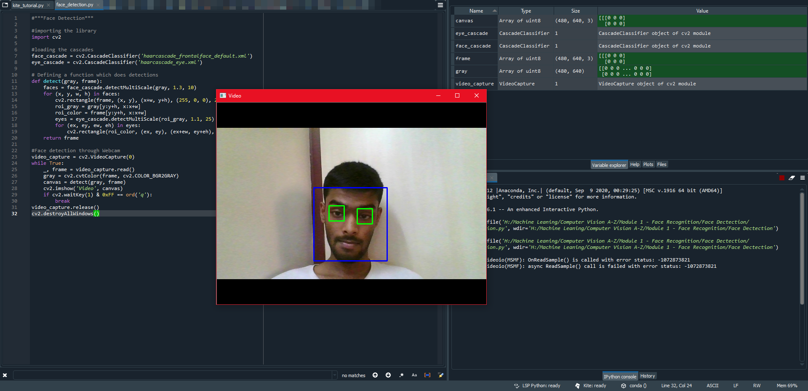

## micro project 1: basic_face_detection_1

### Aim: 
To detect the faces and eyes inside the frame

### Major Steps:
1.) Importing the required Libraries
2.) Loading the pre-trained Classifier
3.) Defining a function which does the detections
4.) Face detection through webcam
5.) Calling the funtion for detection
6.) Previewing the live face detected video

### Haar Cascade Classifier
I've used pretrained Classifiers, i.e haarcascade_frontalface_default.xml (for detecting the face) & haarcascade_eye.xml (for detecting the eyes)

### End Result:

(my neutral face, lol & btw emotion recognision coming soon)
